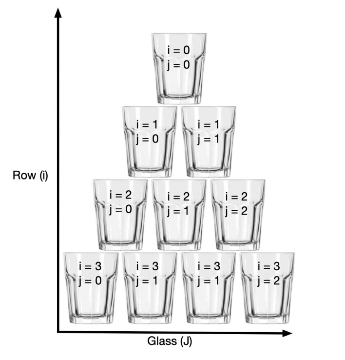

# stack-glass-problem

<!-- [](https://travis-ci.com/mirazmamun/stack-glass-problem)
[](https://codecov.io/gh/mirazmamun/stack-glass-problem) -->
[](https://github.com/sindresorhus/xo)
[](https://github.com/prettier/prettier)
[](https://lass.js.org)
<!-- [](LICENSE)
[](https://npm.im/stack-glass-problem) -->

> Solving amount of water dispensed in glasses stacked in triangular pattern following the image  
This will find out the amount of liquid in any glass depending on amount poured on topmost one.


## Table of Contents

* [Usage](#usage)
* [Test](#Test)
* [Roadmap](#roadmap)
* [Contributors](#contributors)
* [License](#license)


## Usage

The mode of using the program is via CLI. Some flavour or Linux environment is recommended as it it tested on similar environment.
But Windows should work fine as well. To run the program, you need to fulfil the prerequisites:

- `node > 10.x.x`. Checkout this [link][node]
- `npm > 6.x.x`. THe previous command should already install `npm`. Checkout _NodeJS_ docs or forum for troubleshooting.
- This project has made use of `yarn` rather than `npm`. So you can install `yarn` by using `npm i -g yarn`. But nevertheless `npm` will also work. Only drawback is that, `package-lock.json` is not included in the repository, so the **packages version** installed **may not** quite match with those installed on the developer workdirectory.

Check your environment using `node -v && npm -v`. This assumes that you have `node` and `npm` executable in you OS `PATH`.

Then assuming that you have cloned the repository, do the following, **from project root**:

- If you yarn installed then run `yarn install`. Otherwise if you have npm then run `npm install`.
- `node ./bin/index.js` and follow the prompt

## Folder Structure

```
- bin  (D) (the CLI executable script)
- src  (D) (all source codes)
- test (D) (test specs)
- package.json (F) (nodejs package manifest)
... (F) (all other supporting files)
```

## Test

Run the script:

```bash
npm run test
```
or to run specific test do:

```bash
./node_modules/.bin/ava <test file location>
```

Check out the docs for  [ava][ava] for details of tests.

## Roadmap

- Add more code coverage.
- Publish the tool as REST API using `restify` for integrating with any UI that can talk REST.
- Develop an web app to visualize the scenario and interactive form using React or VueJS.

## Contributors

| Name               | Website                              |
| ------------------ | ------------------------------------ |
| **Miraz Al-Mamun** | <https://codarrior.mirazalmamun.xyz> |


## License

[MIT](LICENSE) © [Miraz Al-Mamun](https://codarrior.mirazalmamun.xyz)


## 

[npm]: https://www.npmjs.com/
[node]: https://nodejs.org/en/download/
[yarn]: https://yarnpkg.com/
[ava]: https://github.com/avajs/ava
